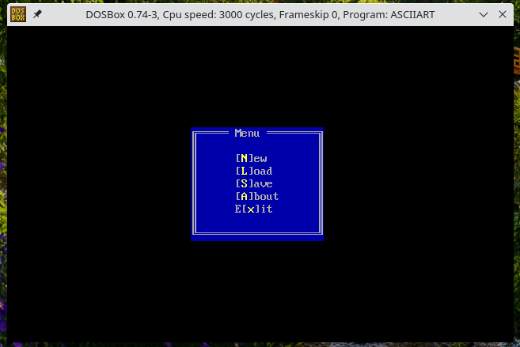
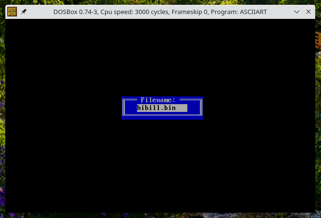

# Ascii-Art Chief
Ascii-Art editor for MS-DOS.
## Overview
I abandon this project, but if you would like to use it - downloads are [here](https://github.com/tstamborski/ascii-art-chief/releases/download/v0.4/asciiart.zip) and some brief info/manual is just right below screenshots.
## Screenshots

## How to use it?
### Features overview
This program is a simple editor for making oldschool ascii-art. It is a 16-bit DOS program and today, easiest way to run it, is to use emulator like a DOSBox. It always runs in deafult 80x25 character mode. Its key feature is to save ascii-art as a self-executable COM files. Besides that it can also save as:
* ANSI/OEM encoded TXT files
* it's own simplistic binary format (BIN or particulary any other extension then mentioned before)
Generally, when you start this program you will see empty screen with a cursor blinking in upper-left corner. Do not worry - you should press Esc to open menu and then you can press X to quit or maybe L to load some example file (HIBILL.BIN or maybe you are clever enough to find an easter egg).
### Keyboard shortcuts

 | KEY                       | FUNCTION                                                           |
 | ------------------------- | ------------------------------------------------------------------ |
 | any printable or spacebar | Enter a character (and move cursor right)                          |
 | `Esc`                     | Open a main menu of this program                                   |
 | `Tab`                     | Open pallette (press second time for background color)             |
 | `Enter`                   | Re-enter last used character                                       |
 | `Backspace`               | Jump left to first different character                             |
 | `F1`                      | Enter hexadecimal code for any possible ASCII character            |
 | `F5`, `F6`, `F7`, `F8`    | Enter ASCII characters like light, medium, dark tone or full block |
 | `Insert`                  | Insert space and shift rest of line right                          |
 | `Shift + Insert`          | Insert blank line and shift rest of page down                      |
 | `Delete`                  | Delete character and shift rest of line left                       |
 | `Shift + Delete`          | Delete whole line and shift rest of page up                        |

### File formats
This program use an extension of file to distinct its type - possible options are COM, TXT or BIN. Any other extension, at this moment, is treated the same as BIN.
* BIN is native simplistic binary format - it is particulary bare video memory data for this mode (80x25 character, al=0x03), one byte of character, one byte of attributes, loop 80x25 times.
* COM is self-executable form of above - particulary you can use it the same way as BIN - both for save and load.
* TXT is used in this program to provide some way of exchanging data with more modern editors. When you save as TXT you lose character and background colors ofcourse. This program can handle both Windows and Unix-like line endings, but cannot handle any more then one byte encoding - for best use ANSI/OEM encoding in your modern editor.
## Known problems and some excuses
* Some antivirus software might rise a false alarm (I don't know really but I suspect it can happen) when you save to COM file - simply ignore that or turn off antivirus if this happens in this situation.
* Generally this program is so ugly written that suprise it works. I was writtening it very fast and didn't care about future. You shouldn't wait for future versions because I have abandoned this project, however who knows, maybe some day I will return to it - like now when I am writting this README.md file :)
